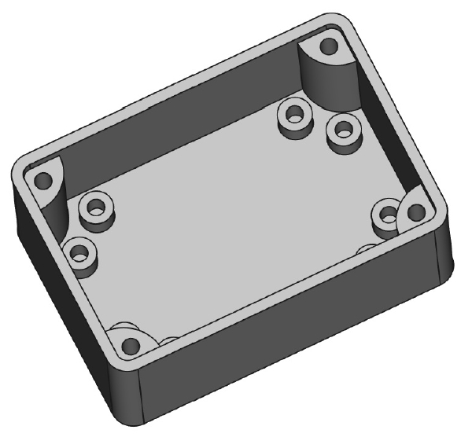
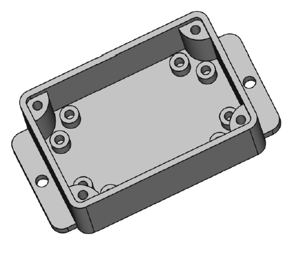

## Modifications to PCB Enclosure project

- Initial Enclosure & Lid can be found in [2-PCB-Enclousre-Lid-Parametric](https://github.com/jithinsisaac/FreeCAD-3D-projects/tree/main/2-PCB-Enclousre-Lid-Parametric) folder, as learned via tutorials found in [Enclosure](https://www.youtube.com/watch?v=cJfbINgyz-k) & [Enclosure + Lid](https://www.youtube.com/watch?v=Re51ZZoZsag) videos by YouTube channel 'Adventures in creation'

- In the above implementation, there were **no provisions** for mounting holes to screw PCBs in OR to hook the entire enclosure as a wall unit.
- In this repo folder, you can find these two additional features in two different files.
  1. Enclosure with parametric mounting holes, two each on each corner
     
  2. Enclosure with parametric mounting holes & hook/holes to mount the enclosure as a wall unit.
     

If you have been benfited by any of these designs, do star the repo!  
Also, you can email me at jithin.dbit [at the rate] dbclmumbai . org with your feedback.

Enjoy!
